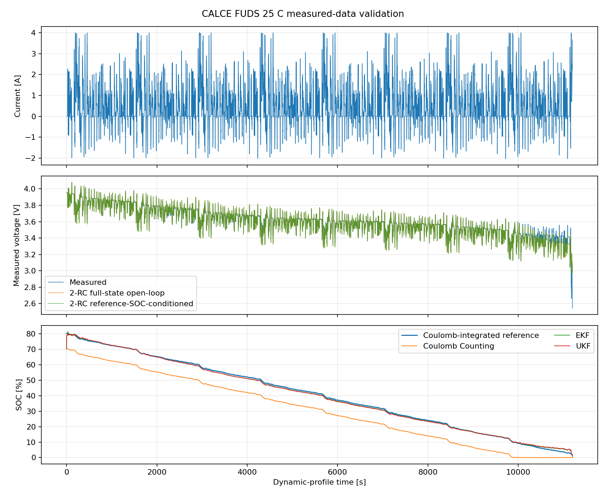
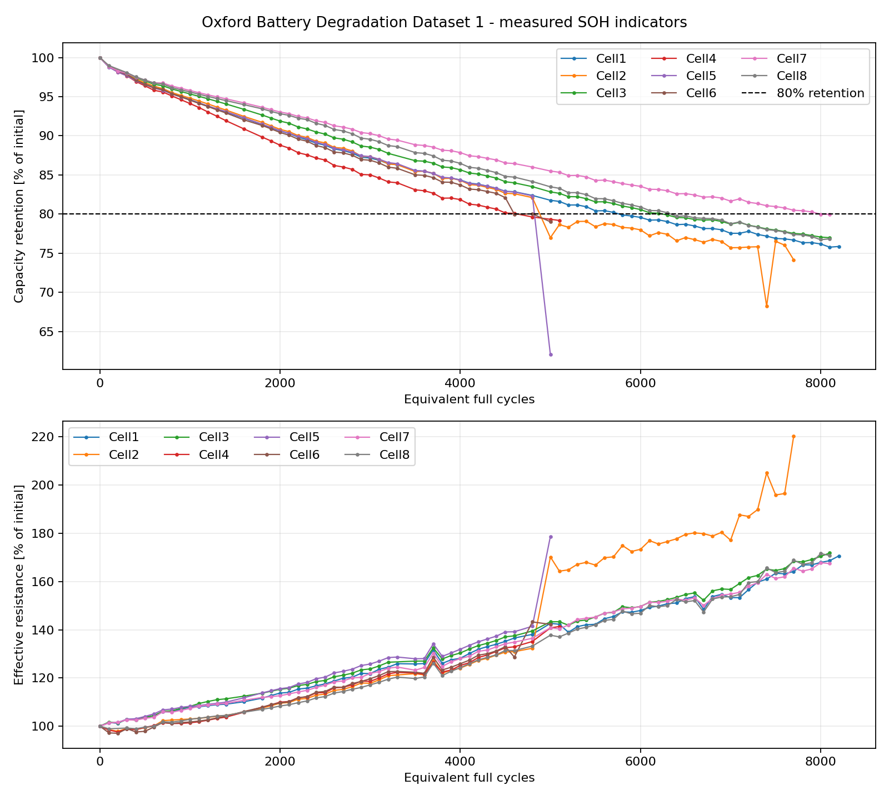
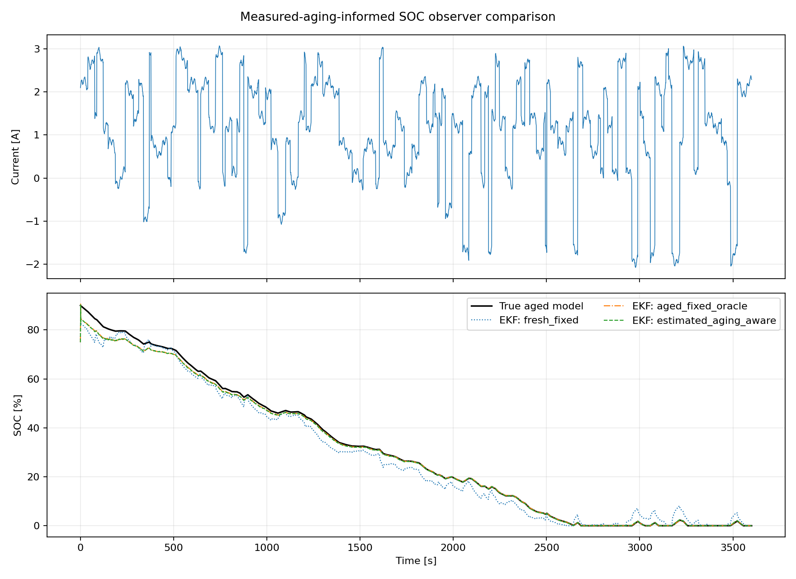
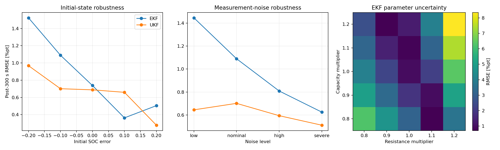

# Battery SOC/SOH Estimation with EKF/UKF and Aging-Aware Modeling

[](CHANGELOG.md)
[](#quick-start)
[](https://github.com/Jerry-124/battery-soc-soh-aging-estimation/actions/workflows/ci.yml)
[](#verification)

A reproducible Battery Management System (BMS) research project for lithium-ion battery modeling, State of Charge (SOC) estimation, State of Health (SOH) tracking, and aging-aware observer adaptation. The repository combines synthetic benchmarks with public CALCE and Oxford measured-data validation and keeps measured, synthetic, and semi-empirical claims explicitly separated.

> Public laboratory datasets are used for validation; the repository author did not perform the underlying cell experiments. The CALCE CX2-3 observer-feedback study is semi-empirical: health factors are measured, while the dynamic SOC/voltage trajectory is generated by the 2-RC model.

## Highlights

- Discrete second-order Thevenin equivalent circuit model (2-RC ECM).
- Coulomb Counting, Extended Kalman Filter (EKF), and Unscented Kalman Filter (UKF) SOC estimation.
- OCV-SOC modeling with an exact Jacobian consistent with the active piecewise-linear interpolation segment.
- Bounded aging-aware capacity and resistance adaptation.
- Pulse-relaxation ECM parameter identification.
- Synthetic nominal, aged fixed-parameter, and aging-aware benchmarks.
- CALCE DST parameter identification with independent CALCE FUDS SOC validation.
- Full-life CALCE CX2-3 capacity-retention and pulse-resistance analysis across 1,185 diagnostic cycles.
- Oxford aging analysis across eight measured pouch cells.
- Explicit separation of first-characterization capacity retention from rated-capacity SOH.
- Initial-SOC, measurement-noise, and parameter-uncertainty robustness matrices.
- Reproducible JSON/CSV metrics, Markdown reports, figures, tests, and CI.

## Model and Estimators

Using discharge-positive current, the 2-RC Thevenin model is

```math
\frac{dz}{dt}=-\frac{\eta I}{3600Q},
\qquad
\frac{dV_i}{dt}=-\frac{V_i}{R_iC_i}+\frac{I}{C_i},
\quad i\in\{1,2\},
```

with terminal voltage

```math
V_t=V_{OC}(z)-IR_0-V_1-V_2.
```

The EKF state is `[SOC, V1, V2]^T`; the UKF propagates sigma points through the nonlinear model without explicit measurement linearization. SOC is bounded to `[0,1]`, covariance updates are stabilized, and the measured-data EKF uses the exact derivative of the repository's piecewise-linear OCV curve.

## Health Definitions

The repository distinguishes two capacity-health quantities when the denominator matters:

```math
\mathrm{Capacity\ Retention}=\frac{Q}{Q_{first}},
\qquad
SOH_Q=\frac{Q}{Q_{rated}}.
```

For the Oxford dataset, `capacity_retention_pct` is normalized by each cell's first measured characterization, while `rated_capacity_soh_pct` uses the 740 mAh rated capacity. These quantities are reported separately and are not treated as interchangeable labels.

For CALCE CX2-3, the full-life capacity ratio is likewise named `capacity_retention_pct` because it is normalized to the first measured diagnostic capacity rather than to a rated-capacity denominator.

Resistance growth is tracked independently through a resistance factor or resistance-based health indicator, depending on the experiment.

## Quick Start

```bash
python -m venv .venv
```

Windows PowerShell:

```powershell
.venv\Scripts\Activate.ps1
python -m pip install --upgrade pip
python -m pip install -e ".[dev]"
```

Linux or macOS:

```bash
source .venv/bin/activate
python -m pip install --upgrade pip
python -m pip install -e ".[dev]"
```

Run verification:

```bash
python -m pytest -q
ruff check .
ruff format --check .
```

Run the synthetic workflow:

```bash
python scripts/identify_parameters.py
python scripts/run_experiment.py --config configs/experiments/soc_benchmark.yaml
python scripts/run_experiment.py --config configs/experiments/aged_fixed_benchmark.yaml
python scripts/run_experiment.py --config configs/experiments/aging_aware_benchmark.yaml
python scripts/generate_report.py
```

Run measured-data workflows after downloading the official datasets:

```bash
python scripts/download_calce_data.py
python scripts/run_calce_validation.py
python scripts/download_oxford_data.py
python scripts/run_oxford_soh_validation.py
python scripts/download_calce_cx2_data.py
python scripts/run_cx2_pulse_aging.py
python scripts/run_aging_aware_comparison.py
python scripts/run_robustness_matrix.py
```

Dataset downloaders validate HTTPS hosts and redirect destinations and verify expected SHA-256 hashes before the data are used.

## Verification

The current suite contains **34 pytest tests**. GitHub Actions validates Python 3.10 and 3.12 and runs dependency checks, source compilation, pytest, Ruff linting, and Ruff formatting checks.

Regression coverage includes estimator recovery, finite physical-parameter validation, measured-data parsing, download security, ECM fitting, robustness aggregation, exact piecewise-linear OCV derivative semantics, true full-state open-loop voltage propagation, reference-SOC-conditioned diagnostics, Oxford retention/rated-SOH denominator definitions, CX2 capacity-retention naming, custom-output isolation, and the public Markdown report-generator contract.

SOC accuracy metrics expose `first_within_2pct_s`, defined as the first sample at which absolute SOC error is no greater than two percentage points. It is intentionally not labeled as persistent convergence time.

## Synthetic Results

These results are generated by the committed configurations and code. SOC errors are reported in percentage points.

| Scenario | Method | RMSE | MAE | Final Error |
|---|---|---:|---:|---:|
| Nominal | Coulomb Counting | 12.059 | 12.059 | -12.106 |
| Nominal | EKF | 0.712 | 0.289 | 0.003 |
| Nominal | UKF | 0.250 | 0.065 | 0.005 |
| Aged, fixed parameters | Coulomb Counting | 7.318 | 6.572 | -0.779 |
| Aged, fixed parameters | EKF | 2.393 | 2.274 | -3.286 |
| Aged, fixed parameters | UKF | 2.339 | 2.214 | -3.303 |
| Aged, adapted parameters | Coulomb Counting | 12.039 | 12.039 | -12.091 |
| Aged, adapted parameters | EKF | 1.258 | 0.718 | 0.060 |
| Aged, adapted parameters | UKF | 0.267 | 0.104 | 0.086 |

The filters use the previous sample's current for state propagation and the current sample's current for terminal-voltage correction; this timing convention is explicit because it matters during current steps.

## CALCE Measured-Data Validation

The measured validation uses Samsung INR18650-20R data at 25 °C from the public CALCE repository. The OCV characterization and dynamic profiles come from different cells of the same model, so a fitted OCV voltage bias and the remaining cross-cell uncertainty are reported rather than hidden.

Identified 2-RC parameters from DST data:

| Parameter | Value |
|---|---:|
| `R0` | 0.07651 Ω |
| `R1` | 0.01392 Ω |
| `C1` | 830.91 F |
| `R2` | 0.03123 Ω |
| `C2` | 5040.22 F |
| DST voltage RMSE | 26.31 mV |

Independent FUDS validation:

| Metric | Result |
|---|---:|
| Full-state open-loop voltage RMSE | 22.38 mV |
| Reference-SOC-conditioned voltage RMSE | 22.38 mV |
| Coulomb Counting SOC RMSE | 9.648 %pt |
| EKF SOC RMSE | 0.740 %pt |
| UKF SOC RMSE | 0.849 %pt |

The corrected EKF RMSE is `0.740 %pt` versus the legacy `0.731 %pt`, an increase of approximately 1.2% that does not change the conclusion or require retuning. The two voltage diagnostics are numerically equal in this setup because both recursions use the same initial SOC, measured current, measured capacity, unit coulombic efficiency, and clipping behavior; they remain separately reported because their definitions differ.



## Oxford Measured Aging Validation

The Oxford Battery Degradation Dataset 1 contains eight Kokam SLPB533459H4 pouch cells with a 740 mAh rating, characterized at 40 °C.

| Measured Aging Result | Value |
|---|---:|
| Mean initial measured capacity | 733.44 mAh |
| Mean final capacity retention | 75.50% of first measured capacity |
| Final capacity-retention range | 62.03–79.97% |
| Mean final rated-capacity SOH | 74.82% of 740 mAh |
| Final rated-capacity SOH range | 61.64–78.76% |
| Mean final resistance factor | 1.704× |
| Linear 60/40 holdout RMSE | 2.847 %pt |
| Quadratic 60/40 holdout RMSE | 1.908 %pt |

Sudden measured capacity and resistance changes are retained rather than removed to make the benchmark smoother. The trend models are transparent offline baselines, not production remaining-useful-life predictors.



## CALCE CX2-3 Full-Life Aging and Observer Feedback

The CX2-3 archive provides 61 valid dated exports and 1,185 sampled diagnostic cycles. Capacity is normalized to the first measured diagnostic value, and 5-second pulse resistance is extracted from the measured pulse response. A causal three-checkpoint median supplies the health estimate used by the observer.

The operational evaluation checkpoint is chosen near a **0.70 capacity-retention factor**, not by re-labeling that ratio as rated-capacity SOH.

| Observer Checkpoint | Measured Value | Causal Estimate |
|---|---:|---:|
| Capacity-retention factor | 0.6946 | 0.7055 |
| 5 s pulse-resistance factor | 1.3194× | 1.3003× |

The observer comparison uses an independent dynamic profile generated by the 2-RC ECM at the measured aged condition. It is therefore a **semi-empirical adaptation benchmark**, not measured dynamic-voltage validation.

| Parameter Case | EKF RMSE | UKF RMSE | EKF Post-300 s RMSE | UKF Post-300 s RMSE |
|---|---:|---:|---:|---:|
| Fresh fixed | 3.178 | 2.876 | 2.848 | 2.680 |
| Aged fixed (oracle) | 1.491 | 0.403 | 0.836 | 0.273 |
| Estimated aging-aware | 1.548 | 0.520 | 0.906 | 0.399 |



## Robustness Results

Robustness experiments vary one uncertainty family at a time around the measured-aging-informed checkpoint.

| Robustness Family | EKF Worst Post-300 s RMSE | UKF Worst Post-300 s RMSE |
|---|---:|---:|
| Initial SOC error | 1.524 %pt | 0.969 %pt |
| Measurement noise | 1.445 %pt | 0.701 %pt |
| Parameter uncertainty | 8.350 %pt | 8.944 %pt |

The high parameter-uncertainty errors are intentionally retained because they quantify the sensitivity that identification and aging adaptation are intended to address.



## Data Provenance and Reproducibility

- CALCE and Oxford raw data are downloaded from their public sources and are not redistributed in the repository.
- Dataset provenance, hashes, and experimental notes are documented in [`docs/data_sources.md`](docs/data_sources.md).
- Curated processed data are stored under `data/processed/`.
- Machine-readable metrics are stored under `results/metrics/`.
- Human-readable reports are stored under `results/reports/`.
- Reproducible figures are stored under `results/figures/`.
- Release history is documented in [`CHANGELOG.md`](CHANGELOG.md).

## Repository Structure

```text
battery-soc-soh-aging-estimation/
|-- README.md
|-- CHANGELOG.md
|-- pyproject.toml
|-- configs/experiments/           # Reproducible benchmark scenarios
|-- docs/data_sources.md           # Dataset provenance and experimental notes
|-- data/processed/                # Curated processed data
|-- scripts/                       # Download, validation, and reporting workflows
|-- src/battery_estimation/
|   |-- data/                      # Synthetic and measured-data helpers
|   |-- models/                    # 2-RC ECM and OCV model
|   |-- estimators/                # Coulomb Counting, EKF, and UKF
|   |-- health/                    # Health metrics and adaptation
|   |-- identification/            # Pulse-relaxation fitting
|   `-- evaluation/                # Accuracy and voltage metrics
|-- tests/                         # 34 automated tests
`-- results/
    |-- metrics/                   # Machine-readable outputs
    |-- reports/                   # Human-readable summaries
    `-- figures/                   # Reproducible plots
```

## Scope

This repository is a reproducible battery-modeling and estimator-development project. It is not a production-certified BMS, a safety component, or a substitute for cell-level validation.

The current scope covers cell-level lumped electrical modeling, SOC estimation, capacity/resistance health tracking, aging-aware observer adaptation, measured-data validation, and controlled robustness evaluation. Pack balancing, electro-thermal gradients, fault diagnosis, embedded deployment, hardware-in-the-loop testing, and functional-safety certification remain outside the current baseline.

## Development Roadmap

Completed work includes the 2-RC ECM, Coulomb Counting/EKF/UKF, measured CALCE and Oxford validation, full-life CX2-3 aging analysis, aging-aware observer feedback, robustness matrices, physical input validation, secure dataset download checks, the v1.1.1 scientific-semantics corrections, and the v1.1.2 reproducibility/terminology consistency patch.

Potential extensions include SOC-dependent ECM parameter maps, stricter cross-cell identification/validation splits, temperature-dependent parameters, joint online SOC-SOH estimation, and broader measured dynamic-profile comparisons.

## License

This project is licensed under the [MIT License](LICENSE).